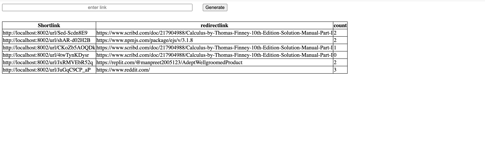

# URL Shortener and Discord Bot

This Node.js application provides URL shortening capabilities and can be extended to create a Discord bot with similar functionality.

## Features

### URL Shortener
- **Shorten URLs:** Converts long URLs into short, easy-to-share links.
- **Custom Short URLs:** Users can create custom short URLs for their links.
- **Analytics:** Tracks click analytics for shortened URLs.

### Discord Bot
- **URL Shortening:** The bot can generate short URLs for long links.
- **Custom Short URLs:** Users can create custom short URLs within Discord.
- **Analytics:** Tracks click analytics for URLs shared through the bot.

## Tech Stack

- Node.js: Backend environment for server-side JavaScript.
- Express: Web framework for Node.js.
- MongoDB: Database for storing short URLs and analytics data.
- Discord.js: Library for interacting with the Discord API.

